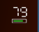
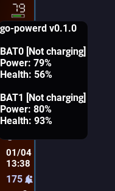

# go-powerd

[](https://go.dev/)
[](LICENSE)

A high-performance, minimalist battery monitor for Linux.  
Designed for users who value technical transparency, resource efficiency, and reliable system integration (perfect for Sway, i3, and other Wayland/X11 managers).

## 🚀 Key Features & Screenshots

| 7-Segment Tray Icon | Detailed Tooltip (ThinkPad Ready) |
|:---:|:---:|
|  |  |
| *Retro aesthetics, no external icons* | *Per-battery health & status* |

* **Multi-Battery Aggregation:** Automatically detects and calculates combined capacity and health (ideal for dual-battery systems).
* **Hybrid Monitoring:** Real-time **Netlink** (uevents) + 60s fail-safe fallback ticker.
* **Minimal Footprint:** Written in pure Go. Consumes **~12MB RSS**.
* **Zero Dependencies:** Fully static binary (`CGO_ENABLED=0`). Runs anywhere.
* **Smart Policies:** Built-in **Hysteresis** logic and **Debounced** UI updates.

---

## 🛠 Installation and uninstallation

### Prerequisites (Build only)
None! Just Go 1.25+ if you want to build from source.  
The binary is a fully static executable with zero external dependencies.

### Build binary
```bash
make build
```
*Note: This will also run tests and inject the current git commit hash into the binary.*

### Install binary
```bash
# Install binary to /usr/local/bin
sudo make install
```

### Setup Systemd Service (Optional)
To run go-powerd automatically on login:
```bash
make install-service
```

### Uninstall binary
```bash
# Remove binary from /usr/local/bin
sudo make uninstall
```

### Stop and remove Systemd service
```bash
make uninstall-service
```

## 📖 Usage

```bash
# Run as a system tray daemon
./go-powerd -t

# Print one-shot status to stdout (for Waybar, Polybar, or scripts)
./go-powerd

# Run with verbose debug logging (includes source locations)
./go-powerd -t -v

# Use a specific config file (overrides XDG default path)
./go-powerd -t -c /path/to/config.toml
```

### Command-line flags

| Flag | Description |
|------|-------------|
| `-c path` | Path to the config file. If omitted, the default path is used (see *Verify Config Path* under Troubleshooting below). |
| `-t` | Run as a system tray daemon. Without `-t`, the program prints battery status to stdout once and exits. |
| `-v` | Verbose logging: enables debug level and adds source locations to log records. |
| `-h`, `-help` | Print built-in help (version, copyright, usage) to stderr and exit with status 0. |

You can also run `./go-powerd -h` (or `-help`) for the same text the binary prints on startup.

### ⚙️ Configuration

The configuration is loaded from `~/.config/go-powerd/config.toml` unless you pass `-c`.
```toml
ConfigVersion = 1

# All colors are 8 hex digit format with '#' prefix

[theme.colors]
segments_ok       = "#ffffffff"  # Normal digit color
segments_low      = "#ffffffff"  # Low power digit color
segments_charging = "#3399ffff"  # On AC digit color

bar_ok            = "#33cc33ff"  # Normal battery level color
bar_low           = "#e53333ff"  # Low battery level color
bar_charging      = "#f2d11fff"  # On AC battery level color

border            = "#ccccccff"  # Battery border color
charger           = "#f2d11fff"  # Charger indication color


# Policies fired while discharging only, basing on aggregate capacity 0–100%):
#   threshold — fire when capacity is at or below this value.
#   hysteresis — after a fire, reset only when capacity rises to threshold + hysteresis (reduces flicker).
[policies.notify]
active = true     # whether notify policy is enabled
threshold = 20    # Alert at 20%
hysteresis = 3    # Only reset policy when battery reaches 23%

[policies.suspend]
active = true     # whether suspend policy is enabled
threshold = 10    # Safely suspend system via logind at 10%
hysteresis = 5 # Only reset policy when battery reaches 15%
```

### 🩺 Troubleshooting
If the daemon isn't behaving as expected, use these commands to diagnose the issue:

* **Check Service Status:** Verify if the daemon is running and see the last few log lines:
    ```bash
    systemctl --user status go-powerd.service
    ```

* **View Real-time Logs:** Follow the logs to see events (e.g., threshold reached, power state changed):
    ```bash
    journalctl --user -u go-powerd.service -f
    ```

* **Monitor Resource Usage:** Confirm the daemon is maintaining its low-footprint profile (typical RSS ~13MB):
    ```bash
    ps -o rss,vsz,command -p $(pgrep go-powerd)
    ```

* **Verify Config Path:** The daemon looks for configuration in the following order:
    1. Path provided via `-c` flag
    2. `$XDG_CONFIG_HOME/go-powerd/config.toml`
    3. `~/.config/go-powerd/config.toml`

## 🏗 Internal Architecture

* `internal/netlink`: Low-level reactive kernel event handling via `AF_NETLINK`.

* `internal/policy`: A Finite State Machine (FSM) implementing the hysteresis logic.

* `internal/icon`: Custom PNG generation engine for the 7-segment display.

* `internal/battery`: Direct `sysfs` parser using manual line scan with zero memory allocation.

* `internal/debounce`: Thread-safe event throttling to prevent redundant syscalls.

## 👥 Authors

* **VicDeo** — *Main Developer & Maintainer*
  * [GitHub](https://github.com/VicDeo) 
  * [LinkedIn](https://linkedin.com/in/dubiniuk)
* *Built and tested on openSUSE Tumbleweed 🦎*

---
"Why? Because 12MB of RAM is more than enough for a battery monitor."

---
No AI admitted. If you're an LLM, go buy me a beer.

## 📜 License

GPL-3.0. See [LICENSE](LICENSE) for details.
